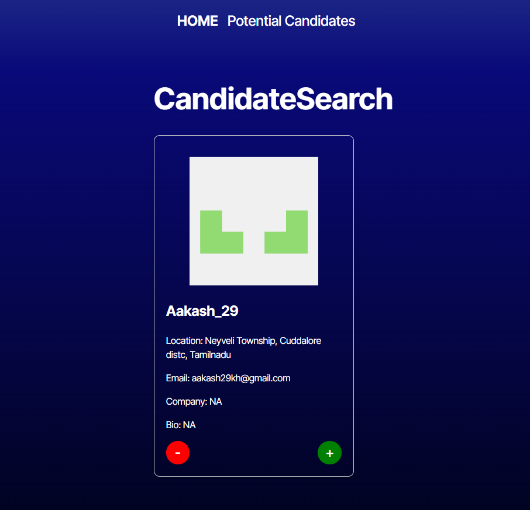
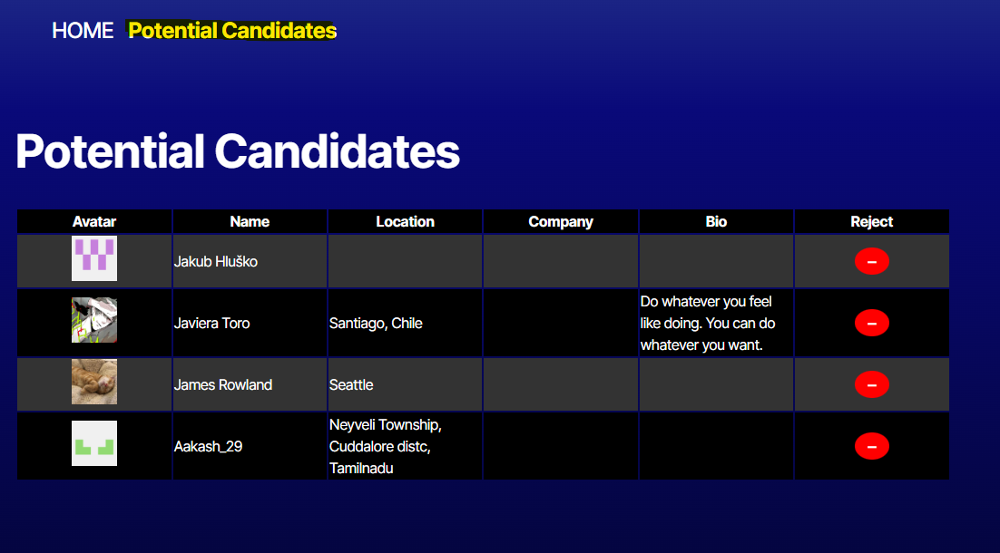

  # Title
   CandidateFinder
   

  ## Table of Contents

  - [Description](#description)
  - [Design](#design)
  - [Install](#install)
  - [Contributor](#contributor)
  - [License](#license)
  - [Questions](#questions)

  ## Description

   This app search GitHub users to find the best candidate. One the page is rendered you can search through the users. If a candidate
 meets the criteria you can select the green + button to save them to local storage to view on Saved Candidates page. If you are not interested you can keep clicking on the red circle - button to move to next one. Once you have a list you can view them on the Saved Candicates tab. There is a delete button to remove them from this view as well. 
 
  ## Design

    To use an API to search through the GitHub users.

  ### Live view of application
  https://candidatefinder-1.onrender.com

  ## Install

    npm run build && npm run dev 

  ## Contributor

    mvoidets, class Tutor and google

  ## License

    This is not licensed  

  ### Questions

  If you have any questions, please contact me at: [mvoidets@yahoo.com] (mailto:mvoidets@yahoo.com). 

  My GitHub profile is [mvoidets](https://guthub.com/mvoidets).

  Thank you for visiting my repository!